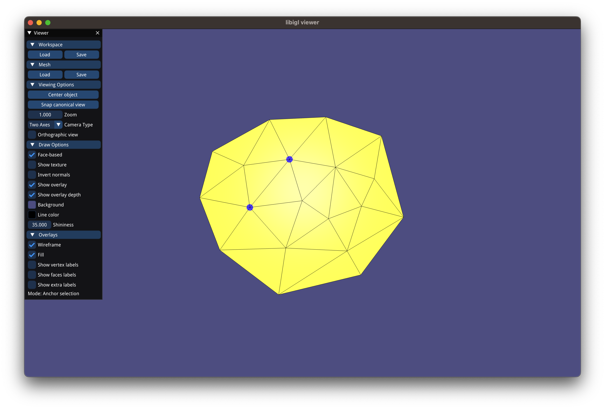

# SGI 2023 Week 6: Design and Simulation of Kirigami Linkages

To get started, clone the repo:
```
git clone --recursive https://github.com/SGI-2023/linkages.git
```

Create your own branch, then switch to the newly created branch:
```
git branch <your-new-branch-name>
git checkout <your-new-branch-name>
```



## Compile

Compile this project using the standard cmake routine:

    mkdir build
    cd build
    cmake ..
    make -j4  ## replace 4 with however many cores you want to use

This should find and build the dependencies and create a `main` binary.

## Run

From within the `build` directory, run:

    ./main [path/to/mesh]

A glfw app should launch.

## Documentation
The [libigl tutorial](http://libigl.github.io/libigl/tutorial/).

## Dependencies

The only dependencies are STL, Eigen, [libigl](http://libigl.github.io/libigl/) and the dependencies
of the `igl::opengl::glfw::Viewer` (OpenGL, glad and GLFW).
The CMake build system will automatically download libigl and its dependencies using
[CMake FetchContent](https://cmake.org/cmake/help/latest/module/FetchContent.html),
thus requiring no setup on your part.

To use a local copy of libigl rather than downloading the repository via FetchContent, you can use
the CMake cache variable `FETCHCONTENT_SOURCE_DIR_LIBIGL` when configuring your CMake project for
the first time:
```
cmake -DFETCHCONTENT_SOURCE_DIR_LIBIGL=<path-to-libigl> ..
```
When changing this value, do not forget to clear your `CMakeCache.txt`, or to update the cache variable
via `cmake-gui` or `ccmake`.
